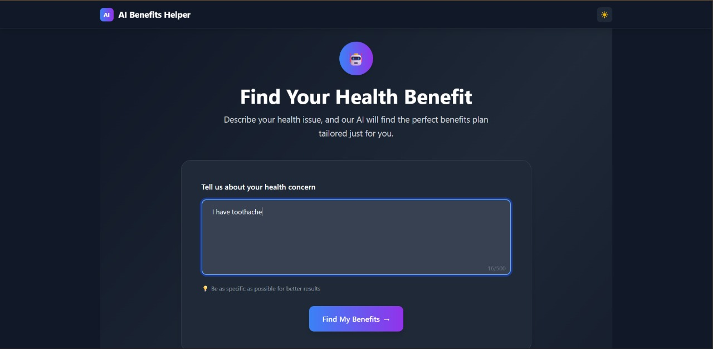

# 🏥 AI Benefits Helper

<div align="center">


[](https://glittery-sopapillas-acb77d.netlify.app/)

*A smart AI-powered application that helps you find the perfect health benefits based on your specific needs*

</div>

---

## 🌟 Overview

**AI Benefits Helper** is an intelligent web application that uses Google's Gemini AI to analyze your health concerns and instantly recommend the most suitable health benefits from a curated database. Whether you need dental care, vision services, mental health support, or general medical consultations, our AI will match you with the perfect benefits.

---

## 📝 Prompts Used and Refinements

### Example Prompts Used

- "I have tooth pain and need help."
- "I feel anxious and want to talk to someone."
- "I need a new pair of eyeglasses."
- "I want to consult a general physician for my recurring headaches."

#### Prompt Refinement Strategy

- The user’s freeform text is sent to the Gemini AI through `geminiService.ts` for classification into one of: Dental, Vision, Mental Health, or OPD.
- If the AI returns a low-confidence result or an ambiguous category, the app prompts the user for clarification.
- The action plan generation prompt is:  
  *“Generate a 3-step, actionable plan for a user to avail this benefit: [Benefit Name]. Tailor the steps for the Indian healthcare context.”*

#### Improvements Made

- Added context to prompts to improve accuracy for Indian benefit schemes.
- Implemented user clarification UI when classification confidence is low.

---

## 🏗️ Architecture Explanation

### High-Level Diagram

```
User Input
   │
   ▼
Gemini AI Classification (via geminiService.ts)
   │
   ├──> Benefits Data Service (benefitService.ts)
   │         │
   │         ▼
   └──> Redux Store (RTK Query)
             │
             ▼
        UI Components (React + Tailwind)
```

### Architecture Choices

- **React 19 + TypeScript**: For type safety, maintainability, and leveraging modern hooks.
- **Redux Toolkit + RTK Query**:  
  - Global state for theme, user’s input, and selected benefits.
  - RTK Query for efficient, cache-aware async data fetching.
- **Context API**: For theme management (`ThemeContext.tsx`) to allow toggling dark/light mode across the app.
- **Vite**: Fast local dev and optimized builds.
- **Gemini API**: AI-powered categorization and action plan generation.

---

## ⚙️ State Management

- **Redux Slices**:
  - `benefitsSlice`: Stores available benefits and filtered results.
  - `userInputSlice`: Tracks health concern text and selected category.
  - `uiSlice`: Modal states, loading, and error messages.
- **ThemeContext**:  
  - Provides `theme` and `toggleTheme` for dark/light mode.
- **RTK Query**:  
  - Handles async AI calls and benefits fetching with loading/error states.

---

## 🖼 Screenshots

<div align="center">

### 1. Home Page (Dark Mode)


### 2. Home Page (Dark Mode, Input Example)


### 3. Matched Benefits (Dark Mode)


</div>

> **Note:** Images above correspond to the following:
> 1. Home page where user describes their health concern (Light Mode)
> 2. Home page with dark theme and sample input
> 3. Results page showing matched dental benefits

---

## 📱 Screen Recording

If running on mobile, please check the [screen recording here](https://drive.google.com/file/d/19wvBRU_J0vKyFPw3qcHPGbQWUpLed30C/view?usp=sharing).

---

## 🚀 Live Demo

**Try it now:** [https://glittery-sopapillas-acb77d.netlify.app/](https://glittery-sopapillas-acb77d.netlify.app/)

---

## 📊 Available Benefits

### 🦷 Dental Benefits
- Annual Dental Check-up & Cleaning (₹3,000/year)
- Root Canal Treatment (50% coverage)
- Tooth Extraction (₹1,500 coverage)

### 👁️ Vision Benefits
- Annual Eye Examination (Free)
- Prescription Eyeglasses (₹5,000 allowance)
- Contact Lens Coverage (₹4,000/year)

### 🧠 Mental Health Benefits
- Therapy & Counseling (12 sessions/year)
- Psychiatric Consultation (80% coverage)
- Mindfulness & Meditation Apps (Premium subscription)

### 🏥 OPD Benefits
- General Physician Consultation (Unlimited)
- Specialist Consultation (5 consultations/year)
- Pharmacy & Lab Tests (20% discount)

---

## 🛠️ Technology Stack

- **React 19** (with hooks)
- **TypeScript**
- **Vite**
- **Tailwind CSS**
- **Redux Toolkit & RTK Query**
- **Google Gemini API**
- **Axios**
- **Lottie React**

---

## 🏗️ Project Structure

```
ai-benefits-app/
├── src/
│   ├── aiservices/           # AI service integrations
│   │   ├── geminiService.ts  # Google Gemini API wrapper
│   │   └── benefitService.ts # Benefits data service
│   ├── app/                  # Redux store configuration
│   ├── components/           # Reusable UI components
│   │   ├── BenefitCard.tsx
│   │   ├── LoadingAnimation.tsx
│   │   └── ThemeToggle.tsx
│   ├── contexts/             # React contexts
│   │   └── ThemeContext.tsx
│   ├── feature/              # Feature-based Redux slices
│   │   └── benefits/
│   ├── pages/                # Application pages
│   │   ├── InputPage.tsx
│   │   ├── BenefitsPage.tsx
│   │   └── ActionPlanPage.tsx
│   ├── types/                # TypeScript type definitions
│   └── assets/               # Static assets
├── public/
│   └── benefits.json         # Benefits database
└── dist/                     # Production build
```

---

## 🚀 Getting Started

### Prerequisites

- **Node.js** (v18 or higher)
- **npm** or **yarn**
- **Google Gemini API Key** (for AI functionality)

### Installation

1. **Clone the repository**
   ```bash
   git clone https://github.com/your-username/ai-benefits-app.git
   cd ai-benefits-app
   ```

2. **Install dependencies**
   ```bash
   npm install
   # or
   yarn install
   ```

3. **Set up environment variables**
   
   Create a `.env` file in the root directory:
   ```env
   VITE_GEMINI_API_KEY=your_gemini_api_key_here
   ```

   > **Note:** Get your Gemini API key from [Google AI Studio](https://makersuite.google.com/app/apikey)

4. **Start the development server**
   ```bash
   npm run dev
   # or
   yarn dev
   ```

5. **Open your browser**
   
   Navigate to `http://localhost:5173` to see the application.

### Building for Production

```bash
npm run build
# or
yarn build
```

The built files will be in the `dist/` directory.

---

## 🔧 Configuration

### Environment Variables

| Variable | Description | Required |
|----------|-------------|----------|
| `VITE_GEMINI_API_KEY` | Google Gemini API key for AI functionality | Yes |

### Customization

- **Benefits Database**: Edit `public/benefits.json` to add/modify available benefits
- **Styling**: Modify `tailwind.config.js` for theme customization
- **API Configuration**: Update API endpoints in `src/aiservices/`

---

## 🚦 Known Issues & Potential Improvements

- Gemini API misclassifies edge-case user inputs.
  - **Improvement:** Add manual override and feedback mechanism for user correction.
- No offline support.
  - **Improvement:** Add service worker and local cache for progressive web app (PWA) support.
- Action plans could benefit from more context (e.g., location-based hospital suggestions).
  - **Improvement:** Integrate location services or user profile data.
- Mobile animations can lag on low-end devices.
  - **Improvement:** Add animation quality selector or fallback static graphics.

---

## 🤝 Contributing

We welcome contributions! Here's how you can help:

1. **Fork the repository**
2. **Create a feature branch**
   ```bash
   git checkout -b feature/amazing-feature
   ```
3. **Commit your changes**
   ```bash
   git commit -m 'Add some amazing feature'
   ```
4. **Push to the branch**
   ```bash
   git push origin feature/amazing-feature
   ```
5. **Open a Pull Request**

### Development Guidelines

- Follow TypeScript best practices
- Use meaningful commit messages
- Ensure responsive design
- Test on multiple devices
- Update documentation as needed

---

## 📄 License

This project is licensed under the MIT License - see the [LICENSE](LICENSE) file for details.

---

## 🙏 Acknowledgments

- **Google Gemini AI** - For providing the intelligent classification capabilities
- **React Team** - For the amazing framework
- **Tailwind CSS** - For the beautiful utility-first CSS framework
- **Vite** - For the lightning-fast build tool
- **Netlify** - For seamless deployment and hosting

---

## 📞 Support

If you have any questions or need help:

- 📧 **Email**: support@aibenefitshelper.com
- 🐛 **Issues**: [GitHub Issues](https://github.com/your-username/ai-benefits-app/issues)
- 💬 **Discussions**: [GitHub Discussions](https://github.com/your-username/ai-benefits-app/discussions)

---

<div align="center">

**Made with ❤️ by the AI Benefits Helper Team**

[](https://github.com/your-username)
[](https://linkedin.com/in/your-profile)
[](https://twitter.com/your-handle)

</div>
